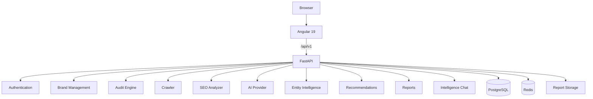

# AI Brand Intelligence

Full-stack SaaS platform for analyzing how a brand is represented across its website and AI-generated responses — combining deterministic website/SEO analysis with AI visibility and entity intelligence.

**Current status:** Portfolio-ready prototype / production-deployable application (not a live hosted product).

---

## Overview

AI Brand Intelligence helps a signed-in user audit a brand they own: crawl the brand website (same-origin, SSRF-aware), run deterministic SEO checks, generate and store AI query responses, score AI visibility and entity strength, produce prioritized recommendations, explore persisted evidence, ask audit-aware questions, and export PDF/JSON report snapshots.

It does **not** measure real search-engine rankings, access proprietary AI-search ranking systems, or claim real-world customer usage. Scores are engineering metrics derived from evidence stored in the platform.

## Why this project

Built as a full-stack interview / portfolio demonstration of:

- Modular monolith architecture (Angular + FastAPI)
- Secure cookie-based authentication and tenant ownership isolation
- Relational modeling with SQLAlchemy / Alembic / PostgreSQL
- Website crawling with robots handling and SSRF defenses
- Deterministic analytics and scoring (explainable, testable)
- Provider-abstracted AI integration (Mock + OpenAI)
- REST API design and Angular feature architecture
- Unit, API, ownership, security, and Playwright E2E coverage
- Docker / Compose, nginx reverse-proxy production layout
- Security engineering documented alongside known limitations

## Core capabilities

### Brand management

- Create, edit, and delete brands
- Ownership isolation (cross-tenant access returns 404)

### Website intelligence

- Same-origin crawling with robots handling
- SSRF protection on user-supplied URLs
- Page extraction and crawl limits

### SEO analysis

- Titles, meta descriptions, canonical URLs, headings
- Word count and structured data checks
- Duplicate metadata, status/response issues, response timing

### AI query analysis

- Deterministic query generation
- Persisted AI responses
- Brand mention detection, citation heuristics, response mention position
- Lexical semantic alignment

### Intelligence scores

- Website Health, SEO, AI Visibility, Entity Strength
- Overall score (currently **provisional**: Website Health + SEO; see [docs/scoring.md](docs/scoring.md))

### Recommendations

- Deterministic rules with priority and impact/effort ranking

### Intelligence dashboard

- Latest owned audit, score summary, insights, recommendation preview

### Query Explorer

- Filters, search, pagination, response evidence (read-only)

### Ask Intelligence

- Contextual questions about one owned audit
- Audit-aware answers with evidence references and bounded context

### Reports

- PDF reports, JSON snapshot metadata, report history, download

Deep dives live under [`docs/`](docs/).

## Architecture



Production shape (same origin for SPA + API):

```text
Browser
  ↓
HTTPS reverse proxy
  ↓
Angular static assets + FastAPI (/api/)
  ↓
PostgreSQL · Redis · report volume
```

Details: [docs/architecture.md](docs/architecture.md) · [docs/deployment.md](docs/deployment.md)

## Tech stack

### Frontend

- Angular 19, TypeScript, Angular Router
- Standalone components, SCSS

### Backend

- Python, FastAPI, SQLAlchemy 2, Alembic, Pydantic
- PostgreSQL, Redis (provisioned; reserved for future queue/cache)

### Intelligence

- OpenAI provider abstraction (Mock default)
- Deterministic scoring and recommendations
- Lexical semantic matching (not embeddings)

### Infrastructure

- Docker, Docker Compose, Nginx example config
- GitHub Actions CI (tests + production image builds)

## Key engineering decisions

| Decision | Why |
| --- | --- |
| **Modular monolith** | Simpler deployment, shared domain model, appropriate scale, easier local development |
| **Deterministic scoring** | Explainability, reproducibility, testability — core metrics do not depend on LLM judgment |
| **AI provider abstraction** | Provider independence; Mock for development/tests; OpenAI isolated behind an interface |
| **HttpOnly JWT cookie** | Avoids `localStorage` token exposure; browser-managed session |
| **Same-origin API** | Simpler production deployment; no exposed internal backend address; simpler CORS |
| **SSRF-aware crawler** | User-provided website URLs are a classic SSRF risk |
| **Persistent report volume** | Generated PDFs must survive container recreation |

## Project structure

```text
.
├── backend/
│   ├── app/
│   ├── tests/
│   └── alembic/
├── frontend/
│   ├── src/
│   └── e2e/
├── deploy/
├── docs/
├── .github/
├── docker-compose.yml
├── docker-compose.prod.yml
└── README.md
```

## Getting started

### Prerequisites

- Docker and Docker Compose (recommended), **or**
- Node.js 22+ and Python 3.12+ for host-side development

### Environment configuration

```bash
cp .env.example .env
```

`.env.example` contains **placeholders only**. Never commit real secrets. Required variables are documented in `.env.example` and [docs/deployment.md](docs/deployment.md).

### Running locally (Docker Compose)

```bash
docker compose up --build
```

Then open:

| Service | URL |
| --- | --- |
| Frontend | http://localhost:4200 |
| Backend API | http://localhost:8000 |
| Health | http://localhost:8000/api/v1/health |
| OpenAPI | http://localhost:8000/docs |

The backend container runs `alembic upgrade head` before Uvicorn in development Compose.

### Host-side notes

- Frontend: `cd frontend && npm install && npm start` (dev proxy to `/api/v1`)
- Backend: create a venv, `pip install -r requirements-dev.txt`, run Uvicorn against Postgres
- From the host, point `DATABASE_URL` at `localhost` (Compose service hostname is `postgres`)

## Testing

| Suite | Command | Working directory |
| --- | --- | --- |
| Backend | `pytest` | `backend/` |
| Frontend unit | `npm test` / `npm run test:ci` | `frontend/` |
| Production build | `npm run build` | `frontend/` |
| E2E (Playwright) | `npm run e2e` | `frontend/` |

CI runs backend pytest, frontend `test:ci` + `build`, and Docker image builds (see `.github/workflows/ci.yml`).

Verified results and skip reasons: [docs/testing.md](docs/testing.md).

## Production deployment

The repository includes production Compose (`docker-compose.prod.yml`), an nginx example (`deploy/nginx.conf`), and fail-fast production settings.

**This application is not claimed to be currently live.** TLS, DNS, managed databases, backups, and edge rate limits remain operator / infrastructure responsibilities.

See [docs/deployment.md](docs/deployment.md).

## Security

Implemented controls include Argon2 password hashing, HttpOnly JWT cookies, CSRF defenses for cookie auth, CORS allowlists, ownership isolation, SSRF-aware crawling, security headers, request limits, in-process rate limiting, AI context containment, and report path safeguards.

Honest residual risks (DNS rebinding, single-process rate limits, OpenAPI exposure unless gated at the edge, prompt-injection limits, dependency upgrades) are documented in [docs/security.md](docs/security.md).

## Documentation

| Doc | Topic |
| --- | --- |
| [docs/architecture.md](docs/architecture.md) | System design |
| [docs/database.md](docs/database.md) | Schema and persistence |
| [docs/scoring.md](docs/scoring.md) | Score formulas and limitations |
| [docs/security.md](docs/security.md) | Threat model and controls |
| [docs/deployment.md](docs/deployment.md) | Production deploy guide |
| [docs/testing.md](docs/testing.md) | Test strategy and results |

Feature docs also cover crawler, SEO, AI provider/query/visibility, entity intelligence, recommendations, dashboard, query explorer, Ask Intelligence, and reports.

## Screenshots / demo

Screenshots and a live demo are **not included** in this repository.

- No verified screenshot assets were present at portfolio packaging time.
- Docker was not available in the packaging environment used for Phase 23, so a running UI could not be captured here.
- **Live demo: not currently deployed.**

Do not assume hosted availability from this README.

## Current limitations

- AI semantic alignment is lexical, not embedding-based
- Citation detection is heuristic
- AI response position is mention order in the response, **not** search ranking
- No external knowledge graph for entity intelligence
- Stored `overall_score` remains provisional (Website Health + SEO); AI Visibility and Entity Strength are scored separately
- No persistent chat history; no streaming AI responses
- Reports are generated synchronously
- No production cloud deployment is included or claimed
- Redis is reserved for future queue/cache usage
- Crawler has a documented DNS-rebinding residual risk
- Password reset / email verification are out of scope

## Roadmap

Future work (not implemented):

- Fold AI Visibility + Entity Strength into a final overall orchestration
- Background audit jobs (Redis-backed queues)
- Richer semantic embeddings
- External knowledge graph integration
- Streaming intelligence chat and persistent conversations
- Scheduled audits and notifications
- Cloud deployment automation
- Advanced reporting / sharing

## License

No license file is present in this repository. Licensing terms are **undecided** — choose and add a `LICENSE` before public distribution if you need explicit terms.

## GitHub portfolio metadata (recommended)

**Description:** Full-stack SaaS platform for website, SEO, AI visibility, and brand entity intelligence.

**Topics:** `angular` `fastapi` `python` `typescript` `postgresql` `saas` `ai` `seo` `docker` `full-stack`

Apply these on the GitHub repository settings when the remote is available. This packaging phase does not modify GitHub remotely.
